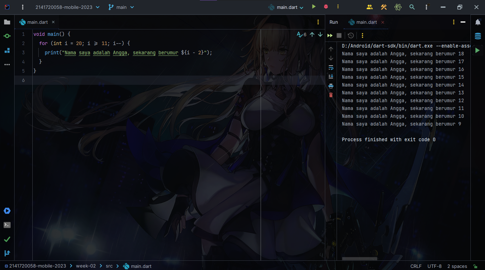

# Soal No.1

# Soal No.2
Mengapa sangat penting untuk memahami bahasa pemrograman Dart sebelum kita menggunakan framework Flutter ? Jelaskan!

Jawab: Karena Bahasa Pemrograman Dart basic dari Flutter, Flutter itu menggunakan Dart dan Flutter sendiri tidak merupakan Bahasa Pemrograman, dia sejenis Framework. Jadi kalau mau pakai Flutter harus belajar Dart dulu karena dasarnya pakai Dart.

# Soal 3
Rangkumlah materi dari codelab ini menjadi poin-poin penting yang dapat Anda gunakan untuk membantu proses pengembangan aplikasi mobile menggunakan framework Flutter.

Jawab: Dart merupakan Bahasa Pemrograman Bertipe OOP, semua merupakan objek sama seperti di Java. Dart memiliki operator sama persis di bahasa pemrograman lainnya, ada satu lagi yaitu operator ~/ (pembagian dengan hasil bilangan bulat). Enaknya di Dart, sudah mendukung null safety yang mana berguna agar program tetap berjalan ketika mendapatkan nilai / objek yang null. Tipe Data bisa strong ataupun weak type. Enaknya lagi saat melakukan perubahan maka baris kode program yang dirubah saja yang akan dikompilasi ulang, ini akan mempercepat waktu eksekusi program dan langsung menampilkan hasilnya.