## Praktikum 1: Menerapkan Control Flows ("if/else")

### Langkah 2:
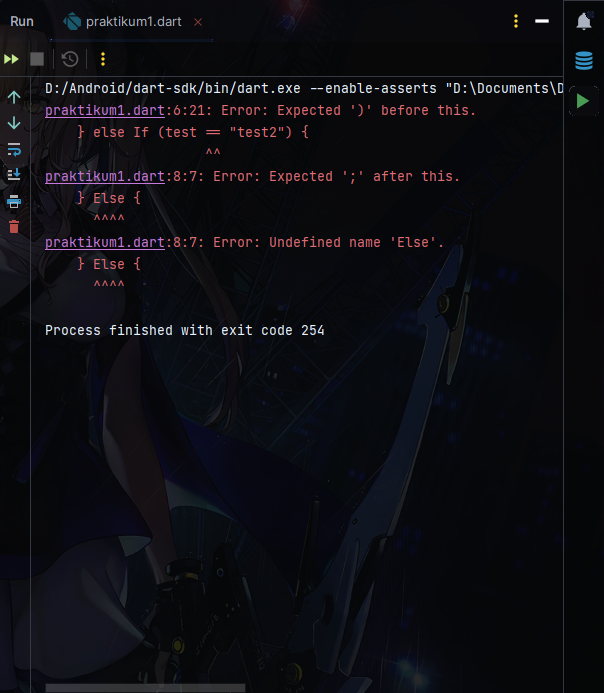

Saat program dijalankan, muncul error bahwa keyword if tidak seharusnya ditulis secara kapital begitu juga dengan else, keyword pada umumnya ditulis dengan huruf kecil semua. berikut perbaikan kodenya:

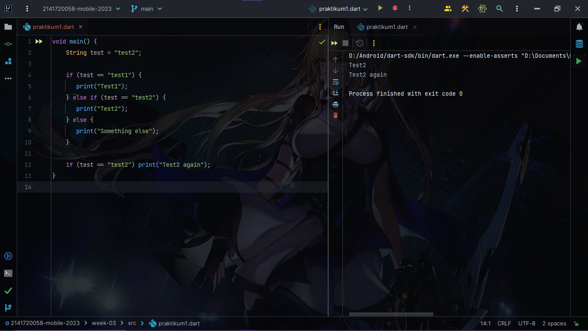
Ganti penulisan keyword if dan else dengan menggunakan lowercase.

### Langkah 3
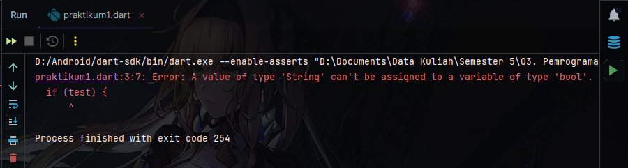

Error di atas dikarenakan parameter if tidak menerima nilai selain boolean (true / false). Seperti digambar, parameter if disi menggunakan tipe data String, karena itulah terjadi error. berikut perbaikan kodenya:

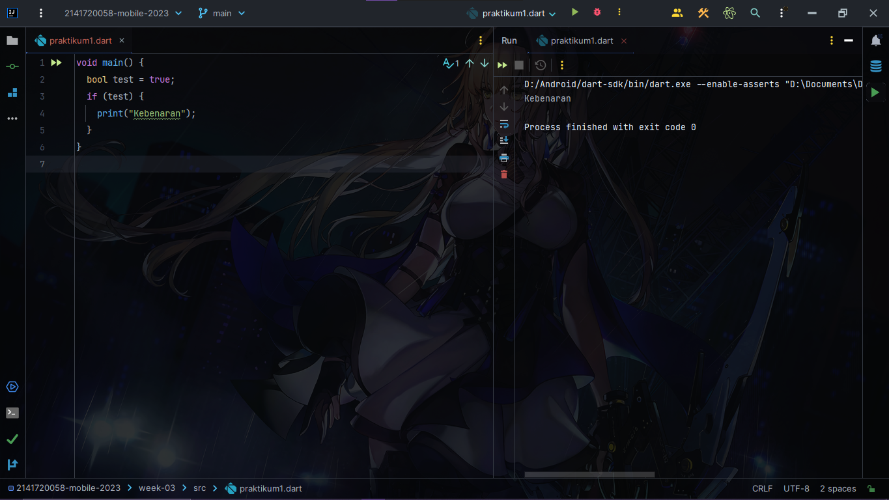

Ganti tipe data variabel test menjadi boolean dan isi dengan nilai true tanpa menggunakan tanda kutip.

## Praktikum 2: Menerapkan Perulangan "while" dan "do-while"

### Langkah 2
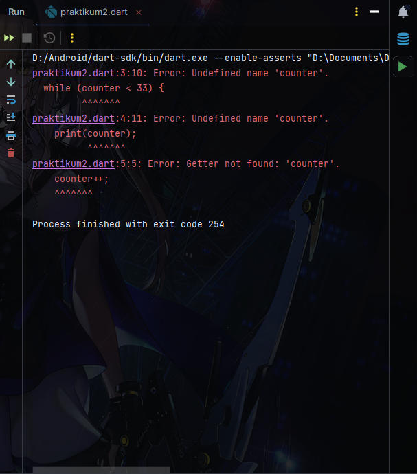

Permasalahannya ada di variabel counter, variabel tersebut sebelumnya belum diinisialisasiakan dan terjadilah error: undefined name 'counter'. berikut perbaikan kodenya:

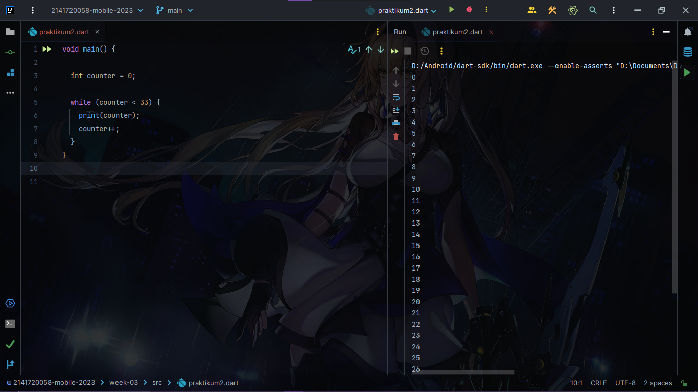

Deklarasikan variabel bernama counter dengan tipe data integer lalu isi dengan nilai awal (contoh 0).

### Langkah 3
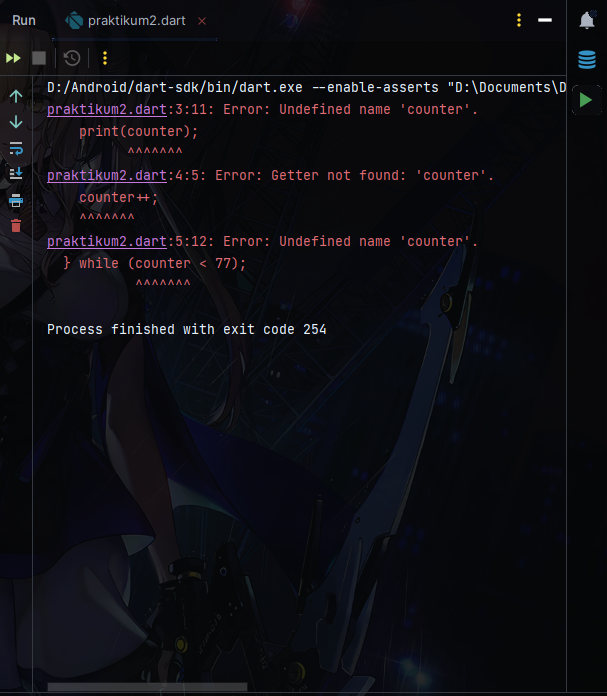

Kalau kode dari gotbook disalin, maka error akan sama dengan langkah 2, jadi solusinya tambahkan variabel counter. Jika variabel counter sebelumnya tidak dihapus lalu mensalin kode praktikum 2 langkah 3, maka tidak terjadi error. berikut perbaikan kodenya:

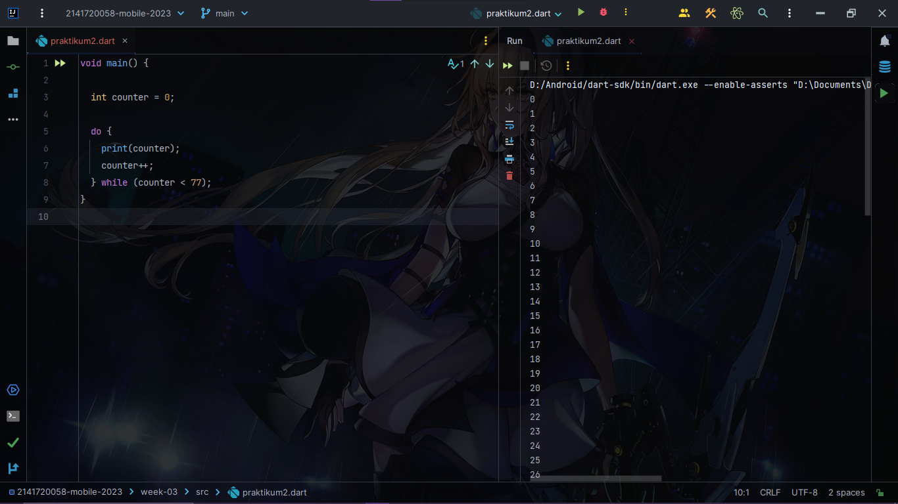

## Praktikum 3: Menerapkan Perulangan "for" dan "break-continue"

### Langkah 2
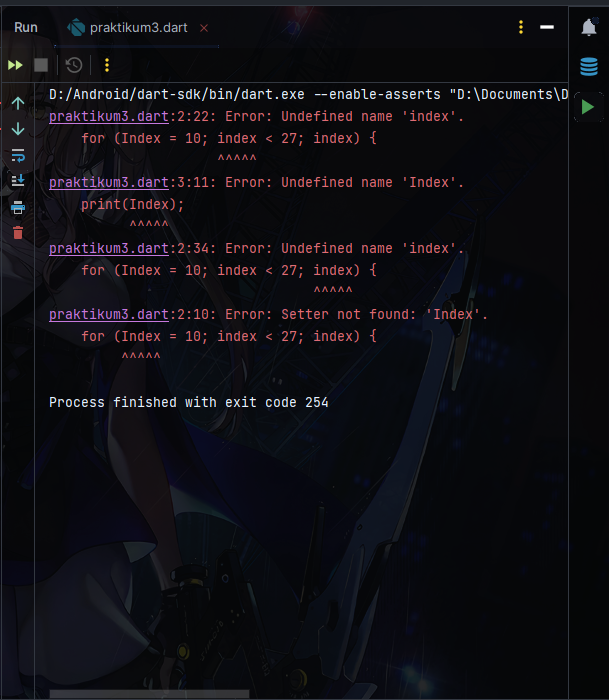

Seperti gambar di atas, terdapat error: undefined name 'Index' / 'index'. error muncul karena variabel tersebut tidak memiliki tipe data untuk menampung nilai iterasi, karena setiap variabel harus memiliki tipe datanya, dicontoh variabel tersebut tidak memiliki tipe data. berikut perbaikan kodenya:

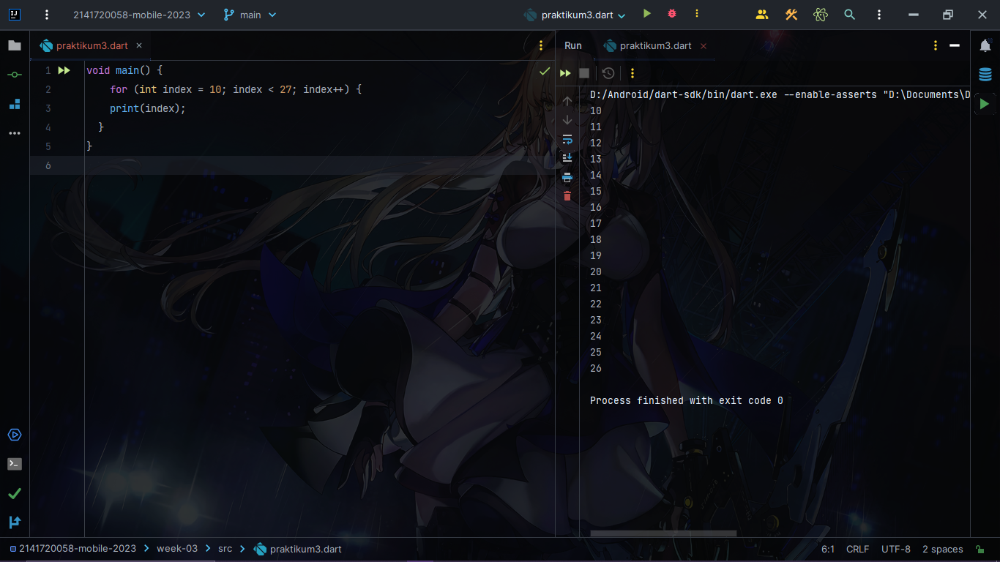

Solusinya beri tipe data integer dan rubah penulisan Index dengan index (pakai lowercase)

### Langkah 3
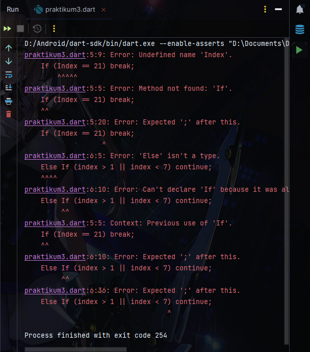

 ada di penulisan keyword kondisi, menggunakan huruf kapital di depannya, ganti dan tulis menggunakan huruf keci semua (lowercase), untuk style penulisannya menggunakan single line sebenarnya bisa saja, tapi tidak disarankan. berikut perbaikan kodenya:

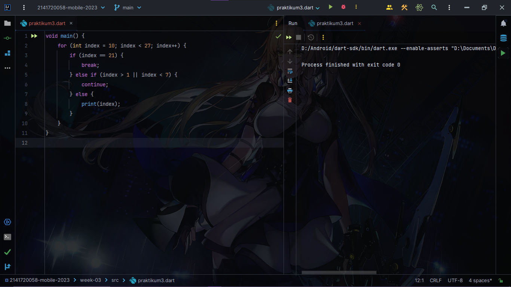

Benarkan penulisan keyword menggunakan lowercase dan tambahkan kurung kurawal setiap badan kondisi, dan khusus print jika tidak memnuhi dua kondisi sebelumnya, lebih baiknya ditaruh di dalam block else. Dan untuk hasil running tidak error tapi tidak muncul apa-apa, karena kondisi else if yang mana jika nilai index > 1 maka akan diskip, tapi kan ada kondisi jika index < 7, berarti kondisi yang melebihi nilai 7 tidak dieksekusi dong.., lihat operator kondisinya, dia pakai or, jika salah satu benar ya program akan dieksekusi, makanya console tidak menampilkan apa-apa, karena nilai index pertama kali adalah 10 (index > 1), dan saat nilai index mencapai 21 keluar dari block if. intinya index > 1 ya skip terus.

## Tugas Praktikum
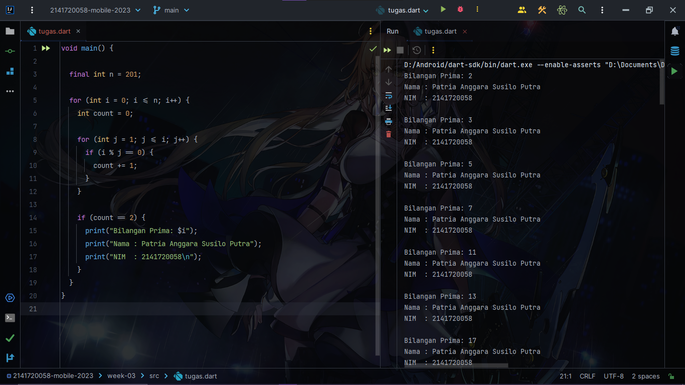