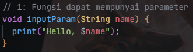

## Praktikum 1: Eksperiment Tipe Data List

### Langkah 1
Salin kode dan taruh di main function

### Langkah 2:
Silakan coba eksekusi (Run) kode pada langkah 1 tersebut. Apa yang terjadi? Jelaskan!

Tampil angka 3, 2, 1. di kode, list dicek menggunakan assert, hasil dari kode diatas adalah benar jadi langsung ke baris selanjutnya. Jadi angka 3 untuk panjang list, angka 2 hasil dari mengakses list index ke 2, dan untuk angka 1 yaitu hasil merubah angka 2 (index ke-2) menjadi satu lalu diassert dan benar, lalu menampilkan angkanya

### Langkah 3:
Ubah kode pada langkah 1 menjadi variabel final yang mempunyai index = 5 dengan default value = null. Isilah nama dan NIM Anda pada elemen index ke-1 dan ke-2. Lalu print dan capture hasilnya.

Tidak ada yang error, mungkin kalau error di tipe datanya tidak diberi null operator / nullable, jadi saat diisi dengan null, program mengalami error

## Praktikum 2: Eksperiment Tipe Data Set

### Langkah 1
Salin kode dan taruh di main function

### Langkah 2
Silakan coba eksekusi (Run) kode pada langkah 1 tersebut. Apa yang terjadi? Jelaskan! Lalu perbaiki jika terjadi error.

Tidak ada yang error, program berjalan dengan baik

### Langkah 3
Mambahkan kode program berikut, lalu coba eksekusi (Run) kode Anda.

Program tidak ada yang error dan menampilkan Set / Himpunan kosong

Tambahkan elemen nama dan NIM Anda pada kedua variabel Set tersebut dengan dua fungsi berbeda yaitu .add() dan .addAll(). Untuk variabel Map dihapus, nanti kita coba di praktikum selanjutnya.

Error saat menabahkan elemen menggunakan fungsi addAll(), karena fungsi tersebut menerima tipe dari Iterator<String> dengan kata lain menerima Colletion lainnya. Berikut agar bisa menggunakan addAll():

## Praktikum 3: Eksperimen Tipe Data Maps

### Langkah 1

Salin kode dan taruh di main function

### Langkah 2

Silakan coba eksekusi (Run) kode pada langkah 1 tersebut. Apa yang terjadi? Jelaskan! Lalu perbaiki jika terjadi error.

Program tidak ada yang error dan berjalan dengan baik

### Langkah 3

Tambahkan kode program berikut, lalu coba eksekusi (Run) 

Tidak ada yang error, untuk key -> 18, yang sebelumnya berisi nilai int berubah menjadi string itu sah saja, karena nilai dari maps bisa apa saja (dinamis) kalau tidak ditulis secara eksplisit.

Tambahkan elemen nama dan NIM Anda pada tiap variabel di atas (gifts, nobleGases, mhs1, dan mhs2). Dokumentasikan hasilnya dan buat laporannya!

## Praktikum 4: Eksperimen Tipe Data List: Spread dan Control-flow Operators

### Langkah 1

Salin kode dan taruh di main function

### Langkah 2

Silakan coba eksekusi (Run) kode pada langkah 1 tersebut. Apa yang terjadi? Jelaskan! Lalu perbaiki jika terjadi error.

tidak ada variabel yang namanya list1, ubah jadi list saja. Perbaikan kode:

### Langkah 3

Tambahkan kode program berikut, lalu coba eksekusi (Run) kode Anda. Apa yang terjadi ? Jika terjadi error, silakan perbaiki.

Terjadi error bahwa lisat yang tidak nullable diisi oleh nilai null. Perbaikan kode: Ganti var pada variabel list dengan tipe data List? -> kasih nullable

Tambahkan variabel list berisi NIM Anda menggunakan Spread Operators. Dokumentasikan hasilnya dan buat laporannya!

### Langkah 4

Salin kode dan taruh di main function dan eksekusi kode.

Error karena variabel promoActive tidak ada, tambahkan variabel dan set nilai ke false untuk nilai awal.

Apa yang terjadi ? Jika terjadi error, silakan perbaiki. Tunjukkan hasilnya jika variabel promoActive ketika true dan false.

Jika nilai promoActive = false, maka elemen 'Outlet' tidak akan ditambahkan, jika sebaliknya maka elemen 'Outlet' akan ditambahkan

### Langkah 5

Salin kode dan taruh di main function dan eksekusi kode

Jika kondisi case diganti selain manager, maka elemen Inventory tidak akan ditambahkan

### Langkah 6

Salin kode dan taruh di main function dan eksekusi kode

Bisa mengisi semua elemen dari list lain ke list tujuan menggunakan for in / each, ini memungkinkan menambahkan langsung elemen ke list baru, sama seperti spread operator, kalau menggunakan for loop memungkinkan untuk menambahkan kondisi tertentu. Contoh:

Jika i dimoulus 2 == 0, maka tampilkan elemen tersebut.

## Praktikum 5: Eksperimen Tipe Data Records

### Langkah 1

Salin kode dan taruh di main function dan eksekusi kode.

Error, kurang semicolon / titik koma di akshir print

### Langkah 2

Silakan coba eksekusi (Run) kode pada langkah 1 tersebut. Apa yang terjadi? Jelaskan! Lalu perbaiki jika terjadi error.

Kalau dijalankan sebelumnya, akan terjadi error karena kurang tanda semicolon setelah print, jadi tinggal nambahkan semicolon. Kata Pak, Shandika: 'Jangan lupa titik koma'

### Langkah 3

Salin kode dan taruh di main function dan eksekusi kode.

Kode berjalan dengan baik. Pertama fungsi tukar menerima inputan tuple yaitu (1,9) nilai ini akan direcord, Kedua dari nilai yang sudah diinputkan dan direcord yaitu melakukan destructuring var (a,b) = record, nilai a = 1 dan b = 9, Ketiga setelah variabel menerima nilai, maka return tuple baru dengan merubah posisi variabel, (a, b) -> (b, a).

### Langkah 4

Salin kode dan taruh di main function dan eksekusi kode.

Terjadi error karena variabel mahasiswa belum diinisialisasi sebelum ditampilkan, agar tidak error inisialisasikan terlebih dahulu sebelum ditampilkan. Perbaikan Kode:

Inisialisasi field nama dan NIM Anda pada variabel record mahasiswa di atas. Dokumentasikan hasilnya dan buat laporannya!

Membuat variabel nama dan nim dan assign dengan variabel mahasiswa (melakukan destructuring variabel mahasiswa)

### Langkah 5

Salin kode dan taruh di main function dan eksekusi kode.

Tidak terjadi error dan program berjalan dengan semestinya

Gantilah salah satu isi record dengan nama dan NIM Anda, lalu dokumentasikan hasilnya dan buat laporannya!

## Tugas Praktikum

### 1. Silakan selesaikan Praktikum 1 sampai 5, lalu dokumentasikan berupa screenshot hasil pekerjaan Anda beserta penjelasannya!
Sudah, Done, Mou, Déjà, Sampun.

### 2. Jelaskan yang dimaksud Functions dalam bahasa Dart!
"This means that functions can be assigned to variables or passed as arguments to other functions.", berarti fungsi di dart bisa dimasukkan ke dalam sebuah variabel, dia dapat memiliki parameter input dan fugnsi yang memiliki return nilai bisa dimasukkan ke dalam sebuah variabel.

### 3. Jelaskan jenis-jenis parameter di Functions beserta contoh sintaksnya!
1. Positional Parameter: fungsi yang memiliki parameter yang mana nantinya jika ingin diisi harus mengikuti urutan parameter.

2. Named Pramater: saat pemanggilan fungsi, nama dari parameter bisa ditulis secara eksplisit.

3. Required Parameter: parameter yang nilainya harus diisi dan tidak boleh kosong.

4. Optional Parameter: parameter yang tidak wajib diisi (opsional), biasanya menggunakan operator nullable.

5. Default Parameter: parameter yang nilainya langsung diisi di setelah mendeklarasikan parameter, jadi saat pemanggilan fungsi, parameter tersebut jika tidak diisi, maka akan mengambil nilai yang sudah diinisialisasikan sebelumnya.

### 4. Jelaskan maksud Functions sebagai first-class objects beserta contoh sintaknya!
Functions sebagai firts class karena fungsi dapat menerima input dari parameter, bisa diassign ke dalam variabel dan bisa membalikkan nilai.

1. Fungsi dengan parameter

2. Fungsi dengan kembalian

3. Fungsi dengan kembalian fungsi lain

### 5. Apa itu Anonymous Functions? Jelaskan dan berikan contohnya!
Anonymous function adalah sebuah fungsi yang tidak memiliki nama, pendekatan ini biasanya digunakan saat ingin menggunakan lambda. 

### 6. Jelaskan perbedaan Lexical scope dan Lexical closures! Berikan contohnya!
1. Lexical Scope: Ketika mengacu pada sebuah variabel, kompiler akan mencari variabel yang ada di dalam cakupan acuan tadi (misal di dalam inner function), lalu jika tidak ada, maka akan mencari di dalam outer function, lalu jika tidak ada lagi maka akan mencari ke liingkup atasnya lagi.

2. Lexical Closure: Kemampuan fungsi untuk mengingat di mana dia dipanggil dan dapat mengakses variabel bahkan di atas lingkup fungsi tersebut.

### 7. Jelaskan dengan contoh cara membuat return multiple value di Functions!

1. Buat fungsi dengan tipe return multiple, contoh -> (String, String)
2. Tulis nama fungsi beserta parameternya (jika perlu)
3. Return nilai multiple dengan menggunakan tanda kurung, contoh -> return ("Pertama", "Kedua")

