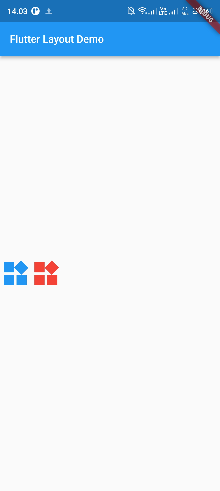

## Nama  : Patria Anggara Susilo Putra
## NIM   : 2141720058
## Kelas : TI3F

## Pemrograman Mobile Minggu 7

# Praktikum

<h3>
    Untuk melihat hasil run Praktikum 5: Navigation bisa
    <a href="#result">klik di sini.</a>
</h3>

### Praktikum 1: Membangun Layout di Flutter

Langkah 1: membuat project baru (sebelumnya pilih sdk flutter lalu isi nama dan lokasi project)

Langkah 2: Buka file lib/main.dart, hasil di bawah menampilkan teks dengan posisi pas di tengah dan mengganti judul dari appbar menjadi "Flutter Layout Demo".

Langkah 4: Implementasi title row, seperti gambar di bawah jika menggunakan row amaka akan disejajarkan secara horizontal.

### Praktikum 2: Implementasi button row

Membuat fungsi _buildButtonColumn lalu taruh tampilkan 3 buah icon dan diatur secara horizontal. Pertama dibuat dulu icon dan labelnya dan ditaruh di dalam Column, label ditaruh di bawah icon dengan dimasukkan ke dalam Container, diberi padding atas sebanyal 8 dan diatur alignmentnya menjadi center, nah panggil fungsi tersebut di fungsi buttonSection dan dibungkus dengan Row, diberi Alignment evenly.

### Praktikum 3: Implementasi text section

Menampilkan deskripsi tentang foto menggunakan Text yang dibungkus dengan Container.

### Praktikum 4: Implementasi image section

Buat folder assets, taruh gambar di folder tersebut. setting file pubspec.yaml, tambahkan assets dengan menuliskan path dari gambar, lalu untuk menampilkan gambarnya menggunakan Image dan set image dengan AssetImage("path_image"). taruh di fungsi imageSection()

## Basic Flutter layout concepts

### 1. Row and Column classes
<table style="width: 100%">
    <thead>
        <th>Menggunakan Row</th>
        <th>Mneggunakan Column</th>
    </thead>
    <tbody>
        <tr>
            <td>
                
            </td>
             <td>
                
            </td>
        </tr>
    </tbody>
</table>

### 2. MainAxisAlignment property
<table style="width: 100%">
    <thead>
        <th>MainAxisAlignment.start</th>
        <th>CrossAxisAlignment</th>
    </thead>
    <tbody>
        <tr>
            <td>
                
            </td>
             <td>
                
            </td>
        </tr>
    </tbody>
</table>

### 3. Flexible Widget
<table style="width: 100%">
    <thead>
        <th>Flexsible widget V1</th>
        <th>Flexsible widget V2</th>
    </thead>
    <tbody>
        <tr>
            <td>
                
            </td>
             <td>
                
            </td>
        </tr>
    </tbody>
</table>

### 4. Expanded Widget

### 5. Sized Widget

### 6. Spacer Widget

### 7. Text Widget

### 8. Icon Widget

### 9. Image Widget

### 10. Putting All Together

      
    <h1>Hasil Run Aplikasi</h1>
    

