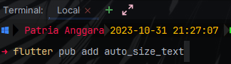
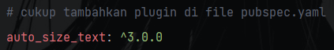
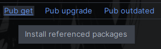
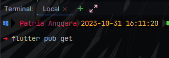
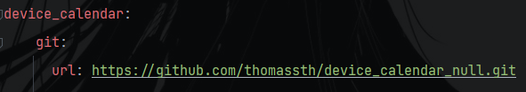
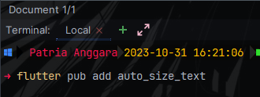
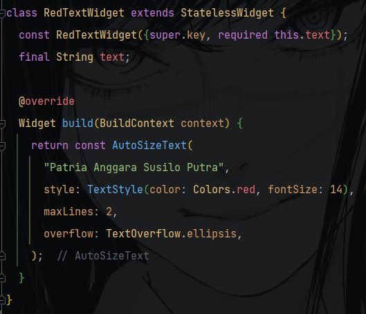
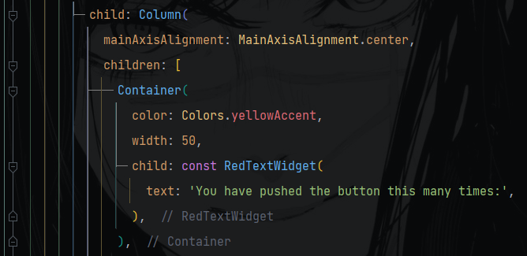
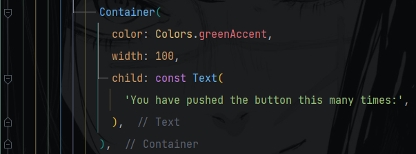

# Praktikum 9 - Manajemen Plugins

### Nama: Patria Anggara Susilo Putra
### No. Absen: 19
### Kelas: TI 3F

### ------------------------------------------------------------
<h3>Langkah 4</h3>

Menginstal plugin lewat terminal

Atau langsung dicopas ke dalam file pubspec.yaml

tanda ^ artinya versi tersebut tidak konstan dan bisa diupdate, jika ingin mendapatkan update terbaru, gunakan tanda ^ dan jika serasa sudah cukup stabil dengan versi saat ini, cukup hilangkan tanda ^.

setelah menambahkan plugin, bisa tekan tombol get pub di bilah atas

atau mengetiknya lewat terminal

### ------------------------------------------------------------
<h3>Langkah 6</h3>

Jika kamu ngebet banget pakai versi terbaru plugin tapi dari pihak yang mmepunyai plugin tersebut belum melakukan merge pada branch mainnya , bisa mneggunakan konfigurasi di bawah ini

### ------------------------------------------------------------
<h3>Langkah 7</h3>

1. Buat dulu project flutternya

2. habis itu tambahkan plugin yang pingin dipakai, di sini pakai plugin yang sebelumnya sudah diinstall

3. mengisi file widget baru dan menambahkan widget auto_size_text

4. tambahkan widget di main.dart

5. hasilnya seperti berikut

### ------------------------------------------------------------
<h3>1. Jelaskan maksud dari langkah 2 pada praktikum tersebut!</h3>

    Praktikum 2 menjelaskan mengenai manfaat dan masalah dalam menggunakan plugins. misal ketika ingin membuat aplikasi skala besar, kita tidak ingin membuat source code kosongan dari awal, maka dar itu plugins berperan di sini. Plugins itu reuseable, dapat digunakan kembali, banyak orang yang menggunakannya jadi jika terjadi error akan lebih mudah mencarinya karena hal serupa dialami juga oleh yang yang menggunakan plugins tersebut, hal ini dipastikan memiliki versi plugin terbaru, meski begitu penggunaan plugins juga berakibat dalam membangun sebuah aplikasi, misalnya sulit untuk mendiagnosa bug dan ketika kita mengupdate plugin, kemungkinan penggunakan pada versi baru dengan sebelumnya berbeda.

<h3>2. Jelaskan maksud dari langkah 5 pada praktikum tersebut!</h3>
<ul>
    <li>methodCall</li>
    

        Komunikasi antar host di flutter,  MethodChannel digunakan untuk mengirim pesan ke sisi platform dan menerima hasilnya. itu juga merupakan teknik peminsakan antar UI dan PLatform.
    

    <li>CocoaPods</li>
    

       Ini dikhususkan untuk mengunduh libary buat IOS, persis seperti gradle, CocoaPods merupakan dependency management, jika memerlukan kode native IOS, maka CocoaPosd akan mengunduh library yang revelan dan memasukkan ke dalam versi IOS.
    

    <li>Gradle</li>
     

        Merupakan build tools agar file proyek saling terintegrasi, untuk menkonfigurasi file proyek, bisa di file android/build.gradle (module level) dan android/app/build.gradle untuk project level, dan bisa mengatur permission di file AndroidManifest.xml
    

</ul>

<h3>3. Pada langkah 6 terdapat dua widget yang ditambahkan, jelaskan fungsi dan perbedaannya!</h3>

    Perbedaannya adalah dari warna teks dan backgroundnya, lalu khusus RedTextWidget merupakan widget kustom yang mengembalikan widget AutoSizeText sedangkan teks kedua memanggil widget bawaan yaitu Text, berbedaan lainnya adalah keresponsifan teksnya, jika menggunakan AutoTextSize teks akan menjadi responsif sedangkan Text biasa tidak responsif.

<h3>4. Jelaskan maksud dari tiap parameter yang ada di dalam plugin auto_size_text</h3>

<ul>
    <li>Key: untuk mengidentifikasikan widget.</li>
    <li>textKey: mengatur teks yang akan ditampilkan, inputan berupa string.</li>
    <li>style: memberikan style teks agar semakin menarik.</li>
    <li> minFontSize: merupakan nilai minimal dari font, jika font sudah berada pada ukuran minimal, maka ukurannya tidak akan bisa mengecil lagi (misal sudah terlalu banyak teks).</li>
    <li>maxFontSize: merupakan nilai maksimal dari font, ukuran tidak akan berubah ketika melebihi batas maksimal ukuran font (misal minim teks tapi containernya lebar).</li>
    <li> softWrap: jika teks terlau panjang, maka secara otomatis akan ditaruh di bawah (bukan membuat baris baru, tapi dilanjutkan dibawahnya).</li>
    <li> wordWrap: jika teks sudah mencapai batas, maka akan otomatis dilanjutkan di bawahnya (baris baru).</li>
    <li>maxLines: menentukan batas maksimal dari jumlah baris teks.</li>
    <li>stepGranularity: menentukan seberapa banyak ukuran font berubah ketika ukuran layar juga berubah. misal diset menjadi 5, maka font akan bertambah atau mengurang sebanyak 5.</li>
    <li> group: berguna untuk melakukan grouping teks jika ingin suatu teks memiliki ukuran yang sama.</li>
    <li> textDirection: mengubah arah teks dari left to right (ltr) bisa diatur menjadi right to left (rtl) .</li>
    <li> locale: digunakan untuk mengatur preferensi bahasa.</li>
    <li>overflowReplacement: menggantikan dnegan widget lain jika teks melebihi batas container.</li>
    <li> textScaleFactor: mengubah ukuran teks pada layout tanpa mengubah ukuran font secara langsung.</li>
    <li> semanticLabel: memberikan deskripsi singkat tentang widget.</li>
    <li>presetFontSizes: membuat daftar dari ukuran font yang telah ditetapkan sebelumnya.</li>
</ul>