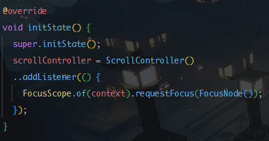
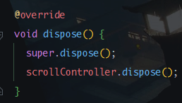
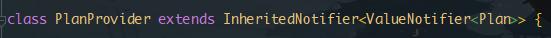
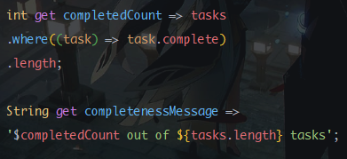
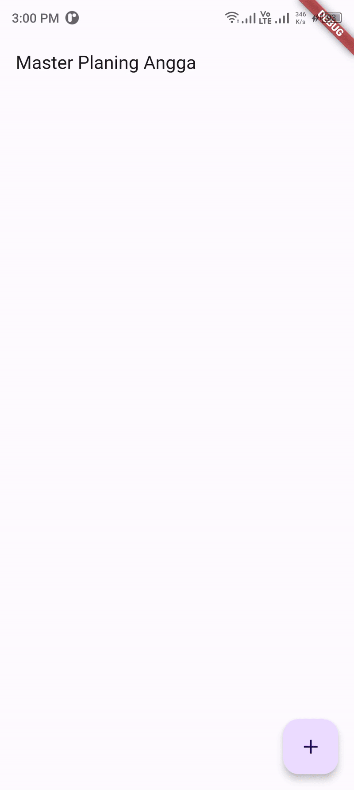
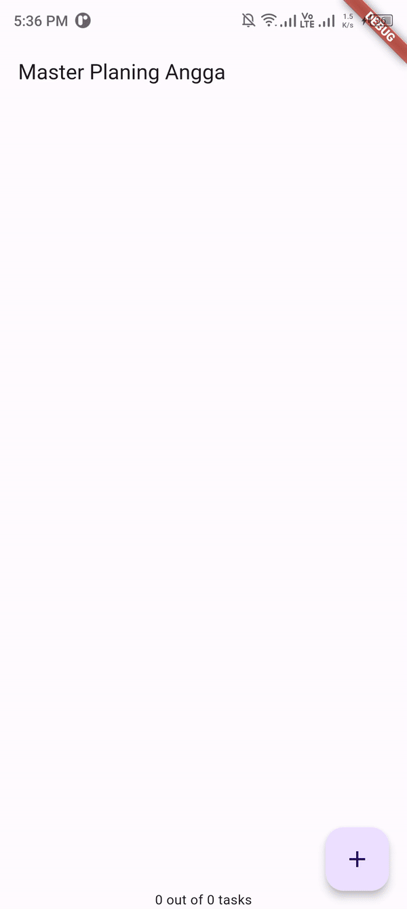

<h2>Nama: Patria Anggara Susilo Putra</h2>
<h2>NIM : 2141720058</h2>
<h2>Kelas : 3F</h2>

<h3>Tugas Praktikum 1: Dasar State dengan Model-View</h3>
<ol>
    <li>
        Jelaskan maksud dari langkah 4 pada praktikum tersebut! Mengapa dilakukan demikian?
    </li>
    <ul>
        <li>
            Cara ini berguna agar file yang diimport nantinya tidak terlalu memakan baris, maka dari itu di dalam class data_layer.dart mengekpor file plan dan tasks yang nantinya tinggal digunakan di dalam class plan_screen.dart.
        </li>
    </ul>
    <li>
        Mengapa perlu variabel plan di langkah 6 pada praktikum tersebut? Mengapa dibuat konstanta ?
    </li>
    <ul>
        <li>
            Karena variabel tersebut nantinya akan digunakan untuk menampilkan data deskripsi plan beserta checkbox plan, jadi ketika tombol add ditekan, checkbox dan fieldtext secara otomatis akan tampil. dan disarankan menggunakan const agar konsistensi data terjaga.
        </li>
    </ul>
    <li>
       Lakukan capture hasil dari Langkah 9 berupa GIF, kemudian jelaskan apa yang telah Anda buat!
    </li>
    <ul>
        <li>
           Jawaban ada di bawah.
        </li>
    </ul>
    <li>
        Apa kegunaan method pada Langkah 11 dan 13 dalam lifecyle state?
    </li>
    <ul>
        
        

            metode yang dipanggil ketika widget pertama kali diinisialisiasikan, di dalamnya membuat objek ScrollController, ketika melakukan scrolling, maka keyboard akan otomatis menghilang.
        

        
        

            Digunakan agar ketika widget scrollController tidak digunakan lagi.
        

    </ul>
</ol>

<h3>Tugas Praktikum 2: InheritedWidget</h3>
<ol>
    <li>
       Jelaskan mana yang dimaksud InheritedWidget pada langkah 1 tersebut! Mengapa yang digunakan InheritedNotifier?
    </li>
    <ul>
         
        
        

            Widget tersebut memungkinkan untuk mendengar / listenable notifier akan melakukan perubahan ketika notifier dipicu. jadi seperti notifier lama tidak sama dengan notifier baru, maka notifikasi akan dikirim.
        

    </ul>
    <li>
        Jelaskan maksud dari method di langkah 3 pada praktikum tersebut! Mengapa dilakukan demikian?
    </li>
    <ul>
        
        <li>
            

                Fungi kedua berguna untuk mengset total plan yang telah selesai dan diberi checklist. Dari fungsi kedua, maka fungsi pertama digunakan untuk mengambil total dari plan yang sudah selesai atau terchecklist.
            

        </li>
    </ul>
    <li>
       Lakukan capture hasil dari Langkah 9 berupa GIF, kemudian jelaskan apa yang telah Anda buat!
    </li>
    <ul>
        <li>
           Jawaban ada di bawah.
        </li>
    </ul>
</ol>

<table>
    <thead>
        <th>Praktikum 1</th>
        <th>Praktikum 2</th>
    </thead>
    <tbody>
        <tr>
            <td>
                
            </td>
            <td>
                
            </td>
        </tr>
    <tbody>
</table>