## Nama: Patria Anggara Susilo Putra
## NIM : 2141720058
## Kelas: 3F

### Praktikum 1

1. Mengganti title dengan nama panggilan.

2. Carilah judul buku favorit Anda di Google Books, lalu ganti ID buku pada variabel path di kode tersebut.

3. Maksud kode **subString** dan **catchError**.
   - subString: mengambil jumlah karakter string dari range tertentu, di sini dari karaketer ke-0 sampai karakter ke-450.
   - catchError: jika terjadi error saat menekan tombol GO, maka block catchError akan dieksekusi dan menampilkan pesan "An error Accurred".

## Praktikum 2

4. Jelaskan maksud kode langkah 1 dan 2 pada praktikum 2!
   -  Langkah 1: membuat tiga fungsi Future, sama-sama mempunyai delay 3 detik, jadi setelah delay 3 detik, fungsi berikutnya akan dieksekusi dan seterusnya.
   - Langkah 2: mengisi nilai total dengan memanggil fungsi pertama, maka nilai total menjadi 1. setelah 3 detik, fungsi kedua akan dipanggil, total menjadi 3. setalah 3 detik, fungsi ketiga akan dipanggil, total menjadi 6 dan total running program menjadi 9 detik.

## Praktikum 3

5. Jelaskan maksud kode langkah 2 tersebut!
   Completer merupakan kelas yang digunakan untuk membuat Future, fungsi getNumber() mengembalikan sebuah Future. Completer digunakan untuk menghubungkan Future dengan operasi asinkronus yang tidak memberikan Future secara langsung. Fungsi calculate() menunggu selama 5 detik sebelum menyelesaikan completer dengan nilai 42.

6. Jelaskan maksud perbedaan kode langkah 2 dengan langkah 5-6 tersebut!
   - Fungsi calculate, menggunakan try and catch, ini berguna untuk menangkap error ketika kode mengalami masalah saat running, sedangkan fungsi calculate pada langkah 2 tidak memiliki try and catch. untuk outputnya sendiri sama.

   - Fungsi getNumber, pada langkah 6 adalah melakukan pengambilan data / get data dari fungsi getNumber pada langkah 2, nilai dari kembalian fungsi getNumber akan diterima oleh parameter value dan menggunakan setState untuk merubah nilai result, di sini juga menggunakan catchError untuk menghandle error yang kemungkinan terjadi saat proses running.

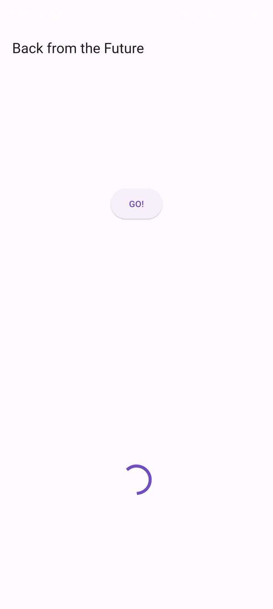

##  Praktikum 4

7. Capture hasil praktikum Anda berupa GIF.
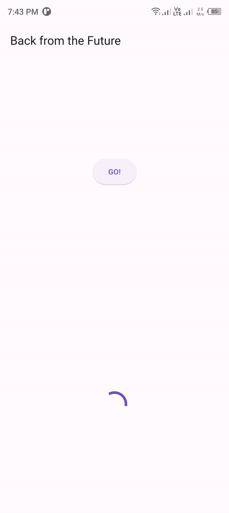

8. Jelaskan maksud perbedaan kode langkah 1 dan 4!.

   - Perbedaannya terletak pada saat menambahkan elemen futureGroup, di langkah 1 membuat terlebih dahulu objek FutureGroup dan menambahkan elemen satu per satu menggunakan fungsi add, pada langkah 4 membuat sebuah list yang berisikan elemen-elemen fungsi.

##  Praktikum 5

9. Capture hasil praktikum Anda berupa GIF.
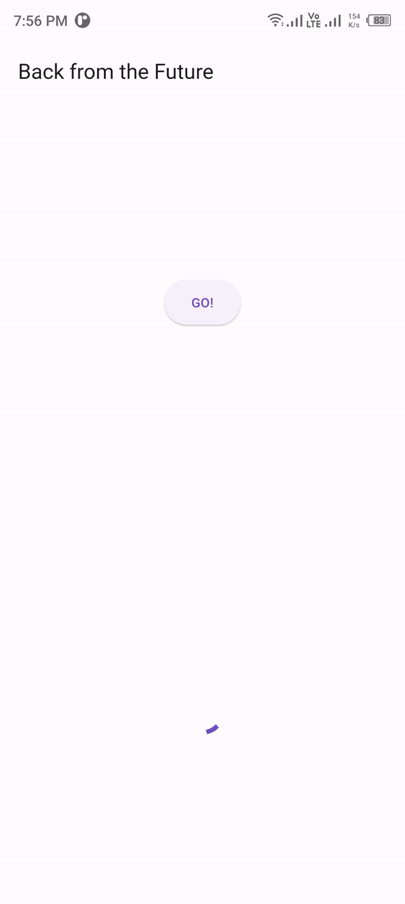

10. Panggil method handleError() tersebut di ElevatedButton, lalu run. Apa hasilnya? Jelaskan perbedaan kode langkah 1 dan 4!.
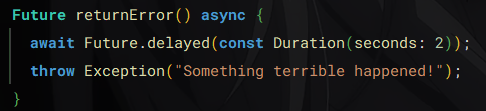
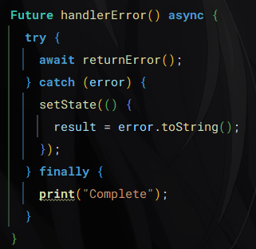

    - hasilnya adalah menampilkan pesan error dan setelahnya diblock finally akan menampilkan pesan complete di terminal, dan perbedaannya adalah langkah 1 menggunakan throw exception untuk menampilkan pesan errornya dan mengisikan variabel result pada langkah 2, sedangkan pada langkah 4 menggunakan try, catch dan finally untuk mengatasi error.

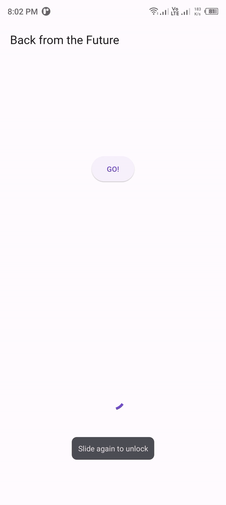

## Praktikum 6

11. Tambahkan nama panggilan Anda pada tiap properti title sebagai identitas pekerjaan Anda.

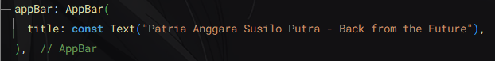
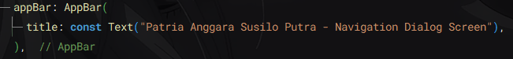
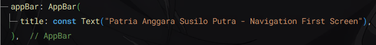
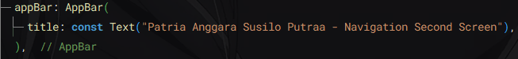
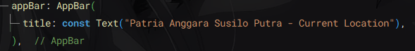
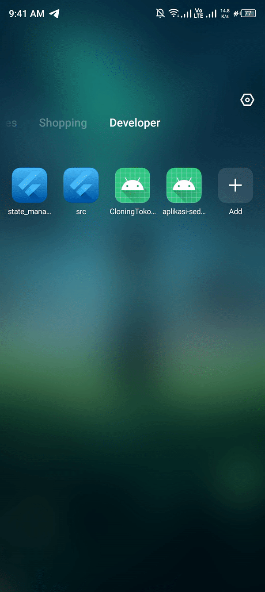

12. Apakah Anda mendapatkan koordinat GPS ketika run di browser? Mengapa demikian?.

    - Titik koordinat tetap muncul walaupun aplikasi dijalankan menggunakan browser, hal ini karena browser akan tetap meminta izin lokasi saat ini, dan ketika user mengizinkannya, maka titik koordinat akan muncul.

## Praktikum 7

13. Apakah ada perbedaan UI dengan praktikum sebelumnya? Mengapa demikian?
    - Tidak ada perbedaan pada tampilan UI-nya

