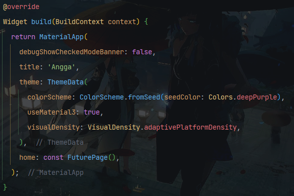
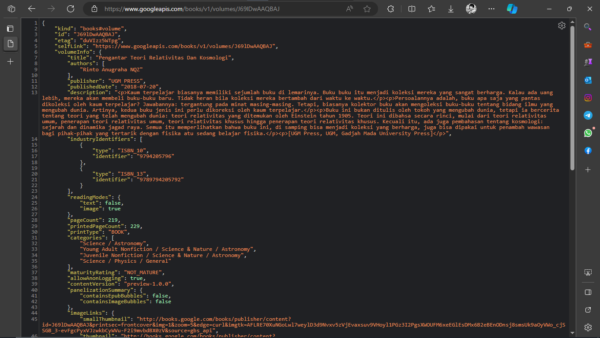

## Nama: Patria Anggara Susilo Putra
## NIM : 2141720058
## Kelas: 3F

### Praktikum 1

1. Mengganti title dengan nama panggilan.

2. Carilah judul buku favorit Anda di Google Books, lalu ganti ID buku pada variabel path di kode tersebut.

3. Maksud kode **subString** dan **catchError**.
   - subString: mengambil jumlah karakter string dari range tertentu, di sini dari karaketer ke-0 sampai karakter ke-450.
   - catchError: jika terjadi error saat menekan tombol GO, maka block catchError akan dieksekusi dan menampilkan pesan "An error Accurred".

## Praktikum 2

4. Jelaskan maksud kode langkah 1 dan 2 pada praktikum 2!
   -  Langkah 1: membuat tiga fungsi Future, sama-sama mempunyai delay 3 detik, jadi setelah delay 3 detik, fungsi berikutnya akan dieksekusi dan seterusnya.
   - Langkah 2: mengisi nilai total dengan memanggil fungsi pertama, maka nilai total menjadi 1. setelah 3 detik, fungsi kedua akan dipanggil, total menjadi 3. setalah 3 detik, fungsi ketiga akan dipanggil, total menjadi 6 dan total running program menjadi 9 detik.

# Praktikum 3

5. Jelaskan maksud kode langkah 2 tersebut!
   Completer merupakan kelas yang digunakan untuk membuat Future, fungsi getNumber() mengembalikan sebuah Future. Completer digunakan untuk menghubungkan Future dengan operasi asinkronus yang tidak memberikan Future secara langsung. Fungsi calculate() menunggu selama 5 detik sebelum menyelesaikan completer dengan nilai 42.

