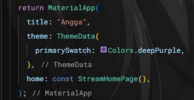
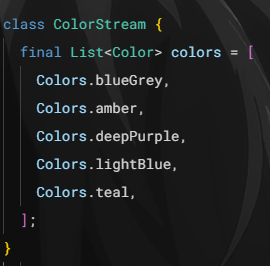
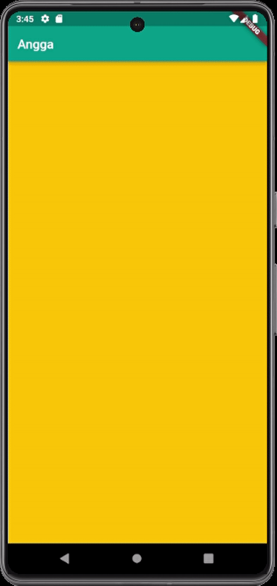
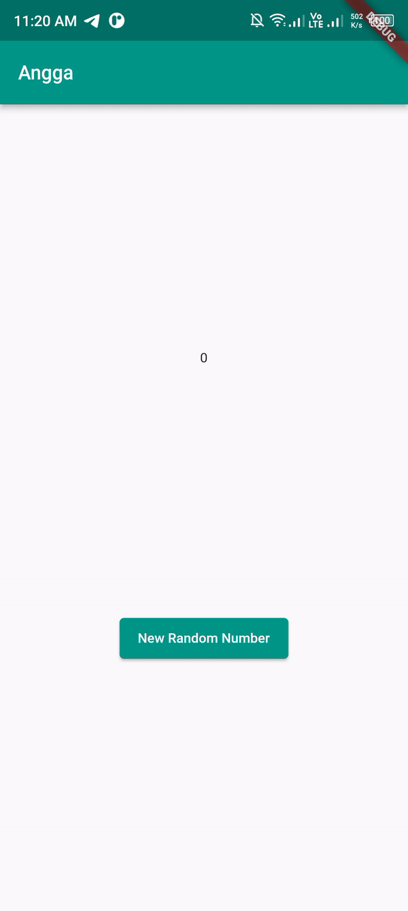
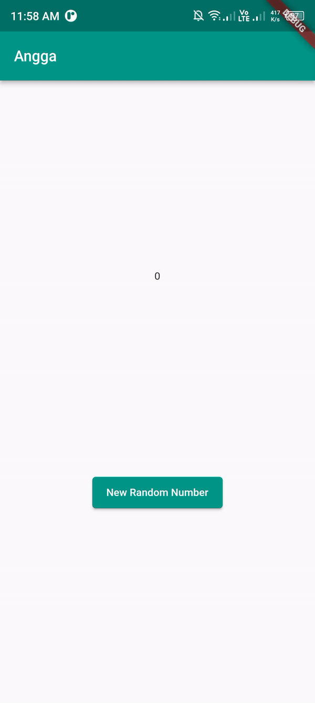
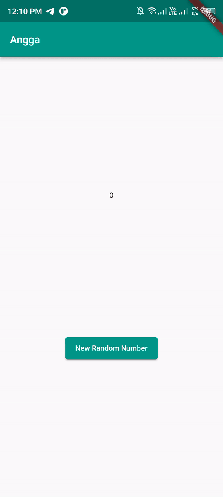
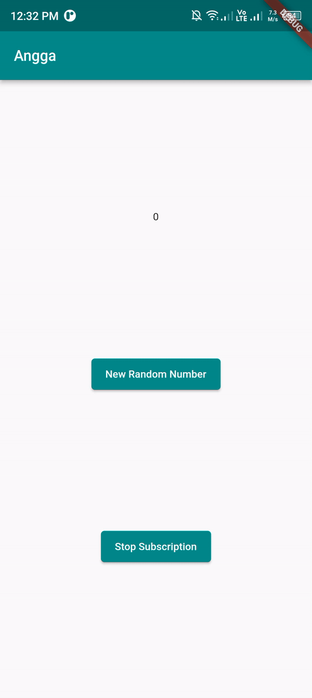
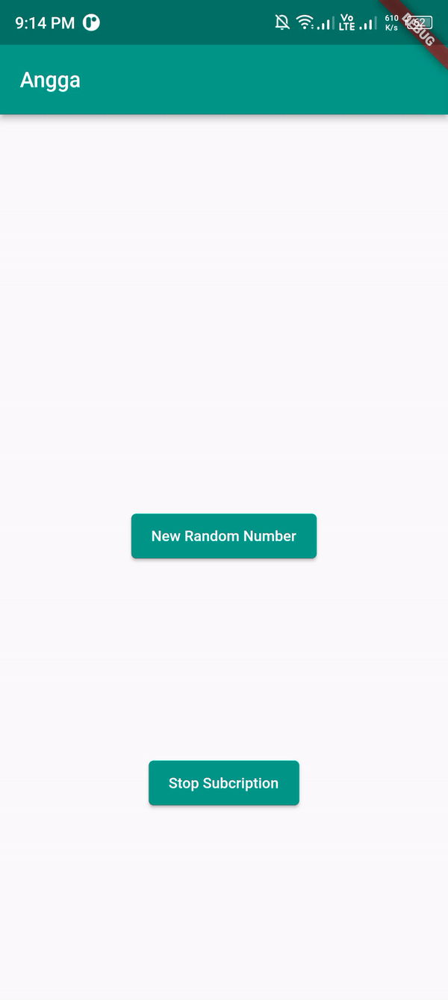
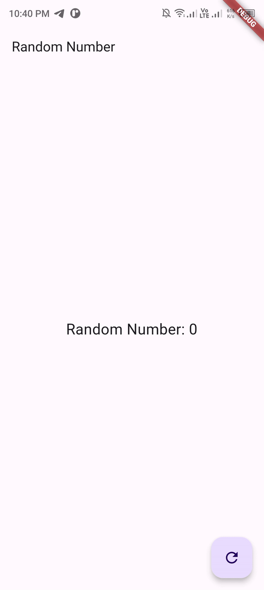

### Nama: Patria Anggara Susilo Putra
### NIM: 2141720058
### Kelas: 3F

---

1. Tambahkan nama panggilan Anda pada title app sebagai identitas hasil pekerjaan Anda dan gantilah warna tema aplikasi sesuai kesukaan Anda.

2. Tambahkan 5 warna lainnya sesuai keinginan Anda pada variabel colors tersebut.

3. Jelaskan fungsi keyword yield* pada kode tersebut! dan apa maksud isi perintah kode tersebut?
   - Jawaban Soal Nomor 3 Point Pertama: fungsi keyword yield adalah untuk mengirimkan data ke stream / aliran, jadi data yang diolah dimasukkan ke yield dan yield nantinya akan mengirimkan data tersebut ke stream, lalu fungsi bintang digunakan jika menggunakan proses asynchronous menggunakan stream.

   - Jawaban Soal Nomor 3 Point Kedua: Perintah kode diatas adlaah untuk menampilkan
   warna acak dengan interval satu detik, warnanya diambil dari list yang telah dibuat
   sebelumnya. Nilai paramter t akan bertambah setiap detiknya dan dimodulo agar tidak 
   melebihi batas panjang dari list warna.

4. Capture hasil praktikum Anda berupa GIF.

5. Jelaskan perbedaan menggunakan listen dan await for (langkah 9)!

    - Jawaban Soal 5 Point Pertama:
      - listen: memanggil callback setiap kali ada event baru, proses akan berjalan terus tanpa menunggu peristiwa selanjutnya.
      - await for: akan menunggu setiap elemen yang diterima dari stream sebelum melanjutkan ke iterasi berikutnya.

6. Jelaskan maksud kode langkah 8 dan 10 tersebut! dan capture hasil praktikum Anda berupa GIF.

   - Jawaban Soal 6 Point Pertama:
     - fungsi initState(): Fungsi ini akan dijalankan saat aplikasi pertama kali 
     dijalankan, membuat objek NumberStream dan mengisi variabel
     numberStreamController dengan objek sebelumnya, lalu mengambil stream 
     dan setiap kali ada perubahan, maka nilai lastNumber akan diperbarui 
     menggunakan SetState().
     - fungsi addRandomNumber(): Fungsi ini berguna untuk menjeneral angka acak antara 0
     sampai 9, menambahkan angka yang dihasilkan ke dalam fungsi addNumberToSi (number).
     - fungsi dispose(): Fungsi ini untuk menutup numberStateController untuk
     membersihkan sumber daya.

7. Jelaskan maksud kode langkah 13 sampai 15 tersebut!

   - Jawaban Soal 7 Point Pertama:
     - Kode program langkah 13 - 15 digunakan jika program mengalami error, contohnya seperti numberStream, pada fungsi addRandomNumber(), membuat objek random dan mengisi nilai random ke dalam fungsi addNumberToSink(number) (sebelumnya), sekarang program mengalami error karena tidak memasukkan angka acak pada fungsi addNumberToSink, maka dikasilah fungsi oneError untuk menghandle error yang terjadi, contoh di atas, jika program mengalami error, maka angka acak akan diset ke -1.

8. Jelaskan maksud kode langkah 1-3 tersebut!

- Jawaban Soal 8 Point Pertama:
  - Transformer digunakan untuk memanipulasi nilai (seperti contoh dikali dengan 10), sebelumnya range angka acak adalah 0 dampai 9, dengan dikalikan 10 maka range angka acak menjadi 0 - 90. Untuk tugas ini diserahkan pada handleData, untuk handleError akan mengirimkan nilai -1 jika terjadi error dan handleDone berfungsi menutup sink setelah stream selesai. angka dirubah dan ditampilkan menggunakan setState()

9. Jelaskan maksud kode langkah 2, 6 dan 8 tersebut! dan capture hasil praktikum Anda berupa GIF.

   - Jawaban Soal 9 Point Pertama:
     - Langkah 2: membuat langganan (StreamSubscription) ke suatu stream dan menentukan bahwa setiap kali ada data baru dalam stream, nilai lastNumber pada antarmuka pengguna akan diperbarui. 
     - Langkah 6: digunakan untuk membersihkan sumber daya dan menghentikan pendengaran pada stream. 
     - Langkah 8: menghasilkan angka acak dan mencoba menambahkannya ke dalam stream. jikstream sudah ditutup, maka nilai lastNumber diatur menjadi -1. Jadi, ada penanganan untusituasi di mana stream sudah tidak dapat lagi menerima data.

10. Jelaskan mengapa error itu bisa terjadi?
    - Error "Bad state: Stream has already been listened to.", hal ini dikarenakan adanya multiple listener pada stream. di dart / flutter, listener hanya bisa digunakan satu kali.

    
11. Jelaskan mengapa hal itu bisa terjadi? dan capture hasil praktikum Anda berupa GIF.
    - Jawaban Soal 11 Point Pertama:
      - Program bisa dijalankan karena pada variabel stream memanggil fungsi asBroadcastStream(), hal ini memungkin kan aplikasi bisa mendengar beberapa listener sekaligus. Makanya saat tombol generate random number ditekan, kedua fungsi subcription terpanggil dan ditampilkan hasilnya.

12. Jelaskan maksud kode pada langkah 3 dan 7! dan capture hasil praktikum Anda berupa GIF.
    - Jawaban Soal 12 Point Pertama:
      - Langkah 3: Membuat angka acak dengan range 0 - 9, lalu mengirimkan data tersebut
        menggunakan yield* ke Stream.
      - Langkah 7: Data yang sebelumnya sudah dialirkan ke stream, dalam BuildStream terdapat parameter bernama stream, ini merupakan destinasi data yang dialirkan oleh Stream, dan parameter build yang memiliki fungsi lambda di mana parameter kedua "snapshot", parameter ini akan menerima data dari stream, dan di dalamnya melakukan pengecekan, kalau ada error maka print error, kalau mempunyai data maka tampilkan datanya, kalau lainnya maka return SizedBox.

13. Jelaskan maksud praktikum ini ! Dimanakah letak konsep pola BLoC-nya? dan capture hasil praktikum Anda berupa GIF.
    - Jawaban Soal 13 Point Pertama:
      - Maksudnya adalah membuat pattern bloc pada aplikasi yang mana nanti fungsinya akan berdampak jika aplikasinya cukup besar, saat membuat class RandomBloc, class tersebut merupakan bloc dan saat ingin menghubungkan dengan class RandomScreen, sebelumnya mendeklarasikan variabel _blocRandomNumber, variabel inilah yang menghubungkan class bloc dengan pengguna class bloc tersebut.

